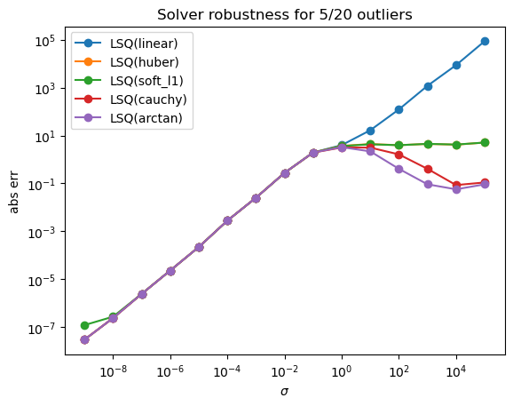

# Source localization problem
You are given a square domain in which there are placed sensors. An impulse source is placed in the domain and fires at $T_{trigger}$. Each sensor registers the time it has received the impulse. Find the position of the source, if the propagation dynamic is:

$$ T_i = T_{trigger} + \sqrt{(\frac{x - x_i}{v_x})^2 + (\frac{y - y_i}{v_y})^2} $$

where $(x,y)$ is the position of the source

# Optimization
The solution of the problem satisfy simultaneously all the sensor constraints. Since there may be errors, we say that the solution satisfy the non linear system in a **least squares** sense.

Selecting an appropriate loss function is critical in the presence of outliers (the goal of this notebook). In that case, alternative loss functions like Cauchy attenuate the contribution of the outliers.

$$ \mathcal{L}(x, y) = \frac{1}{N} \sum_{i=1}^{N} \rho(T_i - \sqrt{(\frac{x - x_i}{v_x})^2 + (\frac{y - y_i}{v_y})^2}) $$

## Optimization in the presence of outliers
By injecting an error on a random sensor, the loss function changes (and so the optimal point)

A simple simulation shows the effect on the solution error as a function of the injected error. The choice of the loss function is critical for being robust to outliers. In this plot the function `scipy.optimize.least_squares` is used to solve a perturbed problem: an unbiased gaussian noise with variance $\sigma^2$ is added to some of the sensors.

## Using "robust" optimizers
I'm interested in improving the error bounds for the least squares optimizers. This problem is hard because an optimizer is only good as its loss (*).

As changing the loss improve the robustness to outlier, the next step is removing the loss contributions of outliers. I found experimentally that the residuals after the first optimization pass are estimators (qualitative) of the perturbation injected in the arrival times.
We can use anomaly detection techniques for filtering out the outlier contributions from the loss function.

The lower bound for such techniques is a method with 100% accuracy on outlier detection. This process is simulated by an oracle that knows which sensor data is anomalous.
