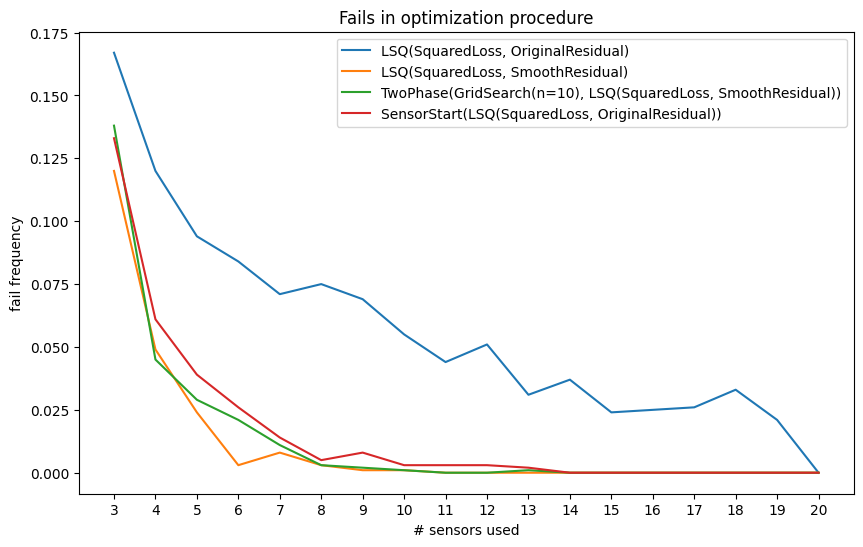
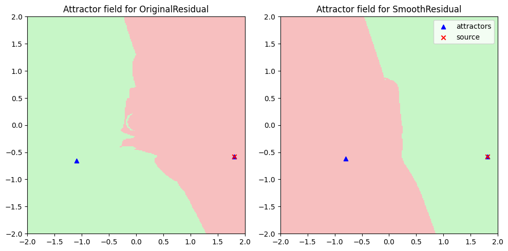
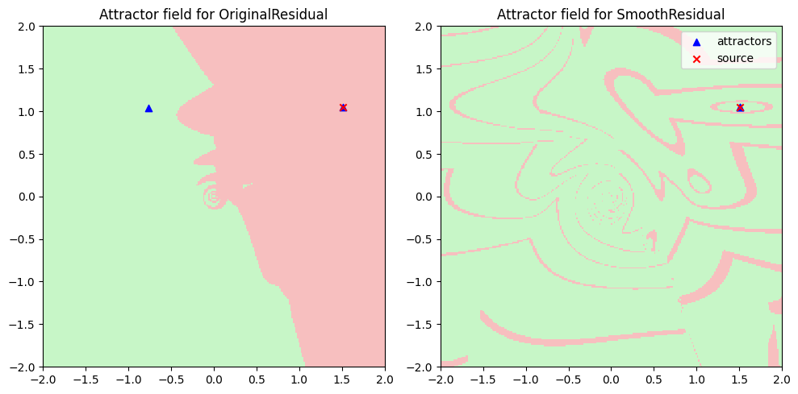
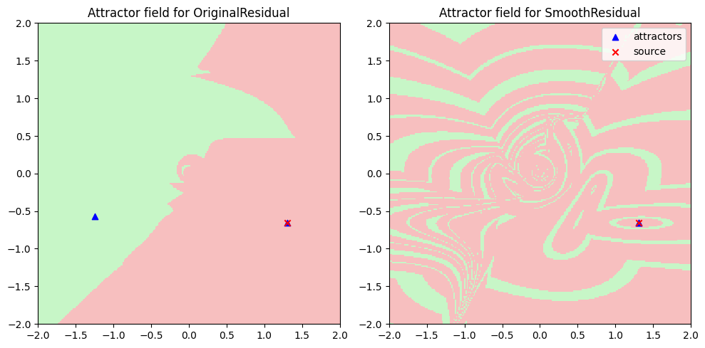

# Source localization problem
A source point is placed in $[-L,L] \times [-L,L]$. At time $T_{trigger}$ emits a signal that propagates in space by the law:

$$ T(x,y) = T_{trigger} + \sqrt{(\frac{x - x_s}{v_x})^2 + (\frac{y - y_s}{v_y})^2} $$

where:
  * $T(x,y)$ is the time the point $(x,y)$ receives the signal
  * $(x_s, y_s)$ is the position of the source

there are 20 sensor placed in the domain at fixed position. Find the position of the signal source given the arrival time measurements at sensor locations. What happens when some sensors are faulty and give outlier data?

## As an optimization problem
We are tasked to simultaneously satisfy the sensor equations

$$ T_i = T_{trigger} + \sqrt{(\frac{x - x_i}{v_x})^2 + (\frac{y - y_i}{v_y})^2} $$

since there are more equations than unknowns and there may be errors, we solve the non linear system in a **least squares sense**. To simplify the calculations we assume $T_{trigger} = 0$.

$$ min_{(x,y)} \sum_{i} \mathcal{L}(T_i - \sqrt{(\frac{x - x_i}{v_x})^2 + (\frac{y - y_i}{v_y})^2} $$

for an appropriate loss function. Note that some loss functions can attenuate the contributions of outliers.

### Regularity (or lack of)
The least squares problem is a very elegant solution, but the loss function is not $C^1$. In fact, the gradients are discontinuous at the sensor locations. This means that a line search optimizer will struggle when approaching sensor locations.

We have experimental evidence that at least 5% of the optimizations fail. Further analysis shows that the problem is ill-conditioned i.e. the termination condition on the gradient is not a good estimator of the error. The plot below shows exponential energy levels, see how squeezed they are

### Patches
Some techniques for lowering the error rate of the optimization procedure are proposed:
  * improve the starting point by a (coarse) grid search
  * start the optimization from the earliest sensor
  * start the optimization from two opposite corner of the domain and pick the best (*DoubleStart*)

while some unmentioned techniques were successful, I couldn't understand why. The whole process is babysitting an optimizer on a bad problem, coming up with techniques valid only for this particular scenario. I find this somewhat against the spirit of numerical optimization which to me sounds like:
> manipulating the problem as to require minimal tuning intervention to the solver/optimizer

## Understand optimization fails
I blame mostly the discontinuities in the loss gradients, but it's more complicated than that. The residual equation can be squared without loss of generality (the solution sets are equal) into

$$ T_i^2 = (\frac{x - x_i}{v_x})^2 + (\frac{y - y_i}{v_x})^2 $$

this new kind of residual is $C^{\infty}$, nevertheless the resulting optimization problem is not convex. In general the problem exibits two attractors as shown in the figure.

I still haven't understood this behaviour, but the plot suggests that multiple restarts are needed. The attractors for the original residual (which has discontinuous gradients) is not even connected!

### Gallery
Here are some interesting images from the optimization. The almost fractal nature of the attractor for the "SmoothResidual" is easily explained. I have used a clustering procedure with two cluster to define the attractors (because they are usually two). When there is only one attractor the clustering procedure returns two close points. The resulting attractors are interleaved and form a cool visualization

